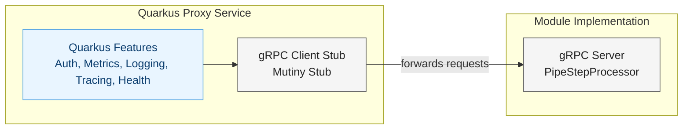

# PipeStepProcessor Proxy Module

This module provides a proxy service that implements the PipeStepProcessor interface in Quarkus and forwards calls to a backend module implementation. It adds Quarkus features like security, metrics, and logging to any PipeStepProcessor module.

## Architecture Overview



## Features

- **Security**: Basic authentication and SSL support
- **Metrics**: Micrometer integration with Prometheus export
- **Logging**: Structured logging with configurable levels
- **Tracing**: OpenTelemetry integration
- **Health Checks**: Microprofile Health integration
- **Error Handling**: Graceful error handling and recovery
- **Configuration**: Externalized configuration via environment variables

## Building and Running

### Building the Proxy Module

```bash
# Make the build script executable
chmod +x docker-build.sh

# Build the Docker image
./docker-build.sh
```

### Running with Docker

```bash
# Run the proxy with the test module
    docker run -i --rm -p 39100:39100 -e MODULE_HOST=host.docker.internal pipeline/proxy-module:latest
```

### Testing the Proxy

```bash
# Make the test script executable
chmod +x test-docker.sh

# Run the test script
./test-docker.sh
```

## Configuration

The proxy service can be configured using environment variables:

| Variable | Description | Default |
|----------|-------------|---------|
| MODULE_HOST | The host where the module is running | localhost |
| MODULE_PORT | The port where the module's gRPC server is listening | 9091 |
| PROXY_PORT | The port where the proxy's HTTP/gRPC server is exposed (maps to quarkus.http.port) | 39005 |
| MAX_RETRIES | Maximum number of connection retry attempts | 5 |
| STARTUP_TIMEOUT | Timeout in seconds for module startup | 60 |
| CHECK_INTERVAL | Interval in seconds between health checks | 5 |

Config mapping notes:
- module.host and module.port are read via MicroProfile Config and map to MODULE_HOST and MODULE_PORT at runtime.
- The proxy listens on quarkus.http.port; when running via the provided scripts/containers, PROXY_PORT is passed and mapped into -Dquarkus.http.port.
- gRPC reflection is enabled in production; message size limits are set to max int to handle large payloads.

## Implementation Details

### PipeStepProcessorProxy

The PipeStepProcessorProxy implements the PipeStepProcessor gRPC service and forwards calls to the backend module while adding metrics, logging, and error handling.

```java
@GrpcService // (1)
@Singleton   // (2)
public class PipeStepProcessorProxy implements PipeStepProcessor { // (3)
  private final MutinyPipeStepProcessorGrpc.MutinyPipeStepProcessorStub moduleClient; // (4)

  @Override
  public Uni<ModuleProcessResponse> processData(ModuleProcessRequest request) { // (5)
    return processingTimer.record(() -> // (6)
      moduleClient.processData(request)
        .onItem().invoke(resp -> { // (7)
          if (resp.getSuccess()) processedRequests.increment(); else failedRequests.increment(); // (8)
        })
        .onFailure().recoverWithItem(err -> // (9)
          ModuleProcessResponse.newBuilder().setSuccess(false)
            .addProcessorLogs("Proxy error: " + err.getMessage()).build() // (10)
        )
    );
  }
}
```
- (1) Exposes a gRPC endpoint using Quarkus gRPC.
- (2) Single instance managed by CDI.
- (3) Implements the shared PipeStepProcessor contract.
- (4) Mutiny-based gRPC client to the real module.
- (5) Forwards processData requests.
- (6) Times the call via Micrometer timer.
- (7) Hook to observe successful responses.
- (8) Increments success/failure counters.
- (9) Centralized error recovery on backend failures.
- (10) Builds a safe failure response when the backend is unavailable.

Additional behavior:
- Metrics: proxy.requests.processed, proxy.requests.failed, proxy.processing.time
- Logging: debug for flow, warn/error on failures

### ModuleClientFactory

Creates and manages the gRPC client channel and stub used by the proxy.

```java
@ApplicationScoped // (1)
public class ModuleClientFactory { // (2)
  @ConfigProperty(name = "module.host", defaultValue = "localhost") String moduleHost; // (3)
  @ConfigProperty(name = "module.port", defaultValue = "9091") int modulePort;       // (4)
  private ManagedChannel channel; // (5)

  public MutinyPipeStepProcessorGrpc.MutinyPipeStepProcessorStub createClient() { // (6)
    if (channel == null || channel.isShutdown()) { // (7)
      channel = ManagedChannelBuilder.forAddress(moduleHost, modulePort).usePlaintext().build(); // (8)
    }
    return MutinyPipeStepProcessorGrpc.newMutinyStub(channel); // (9)
  }

  @PreDestroy void shutdown() { if (channel != null) channel.shutdown(); } // (10)
}
```
- (1) One factory for the app lifetime.
- (2) Small utility, no extra state beyond the channel.
- (3)-(4) Reads MicroProfile config (mapped from env vars, see Configuration).
- (5) Reused gRPC channel.
- (6) Provides the Mutiny Stub used by the proxy.
- (7) Lazily creates the channel.
- (8) In dev it uses plaintext; enable TLS in prod.
- (9) Returns a non-blocking client stub.
- (10) Gracefully closes the channel on shutdown.

### Health Check

ProxyHealthCheck verifies connectivity to the backend module.

```java
@Readiness @ApplicationScoped // (1)
public class ProxyHealthCheck implements HealthCheck { // (2)
  @Inject ModuleClientFactory clientFactory; // (3)
  public HealthCheckResponse call() {
    var client = clientFactory.createClient(); // (4)
    boolean ok = client.getServiceRegistration(RegistrationRequest.newBuilder().build()) // (5)
      .onItem().transform(x -> true)
      .onFailure().recoverWithItem(false)
      .await().atMost(Duration.ofSeconds(5)); // (6)
    return (ok ? HealthCheckResponse.named("proxy-module-backend-connection").up() :
                 HealthCheckResponse.named("proxy-module-backend-connection").down()).build(); // (7)
  }
}
```
- (1) Readiness check exposed via MicroProfile Health.
- (2) Standard HealthCheck contract.
- (3) Reuses the same client factory.
- (4) Creates a client to the backend.
- (5) Calls a lightweight endpoint to test connectivity.
- (6) Protects with a short timeout.
- (7) Reports UP/DOWN accordingly.

## Deployment Options

The proxy service can be deployed in several ways:

1. **Sidecar Container**: Deploy the proxy as a sidecar container alongside the module in Kubernetes
2. **Single Container**: Package both the proxy and module in a single container
3. **Separate Containers**: Deploy the proxy and module as separate containers

## Benefits

1. **Separation of Concerns**: Module developers focus on business logic, while the proxy handles infrastructure concerns
2. **Standardized Infrastructure**: Consistent security, monitoring, and logging across modules
3. **Technology Flexibility**: Modules can be implemented in any language that supports gRPC
4. **Operational Advantages**: Simplified deployment and management