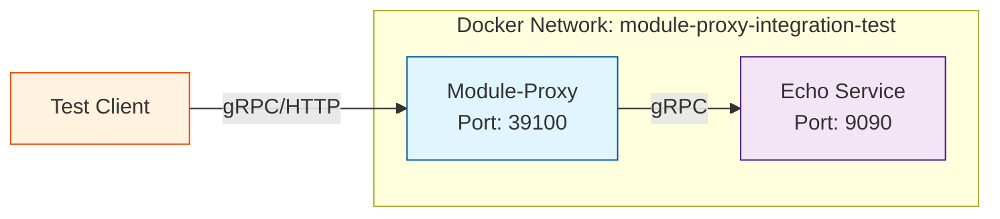

# Module-Proxy Integration Test

This integration test demonstrates the module-proxy service working as a sidecar to the echo service. This setup validates that the module-proxy can successfully proxy gRPC requests to a real backend service.

## Architecture



## Components

### 1. Echo Service
- **Image**: `ghcr.io/ai-pipestream/echo:5cdcff2eb40f1d6b9f184f4c228a566fefc1a94b`
- **Port**: 9090 (gRPC)
- **Purpose**: Backend service that echoes back requests, used as a test implementation of the PipeStepProcessor interface

### 2. Module-Proxy
- **Image**: `rokkon/proxy-module:latest`
- **Ports**:
  - 39100 (HTTP/gRPC with Quarkus features)
  - 9090 (gRPC)
- **Purpose**: Proxy service that adds Quarkus features (security, metrics, health checks) to the echo service

## Prerequisites

Before running this integration test, ensure you have:

1. **Docker** and **Docker Compose** installed
   - Docker Compose v2 (`docker compose`) or v1 (`docker-compose`)
   - The scripts automatically detect which version you have
2. **grpcurl** installed (for testing gRPC endpoints)
   ```bash
   # macOS
   brew install grpcurl

   # Linux
   go install github.com/fullstorydev/grpcurl/cmd/grpcurl@latest

   # Or download from: https://github.com/fullstorydev/grpcurl/releases
   ```
3. **curl** (usually pre-installed)
4. **Built the module-proxy Docker image**:
   
   **Note**: This integration test requires the `rokkon/proxy-module:latest` Docker image to be built locally.
   
   If you're running this from the module-proxy repository root:
   ```bash
   cd ../..  # Go to module-proxy root
   ./docker-build.sh
   ```
   
   If the build script doesn't work (e.g., if you're in a standalone clone of this repo), you'll need to:
   - Build the module-proxy application using Gradle
   - Create a Docker image tagged as `rokkon/proxy-module:latest`
   - See the main repository for full build instructions

## Quick Start

1. **Start the services:**
   ```bash
   docker compose up -d
   # or for older Docker Compose v1:
   # docker-compose up -d
   ```

2. **Run the integration tests:**
   ```bash
   chmod +x test-integration.sh   # Ensure the script is executable
   ./test-integration.sh
   ```

3. **Stop the services:**
   ```bash
   docker compose down
   # or for older Docker Compose v1:
   # docker-compose down
   ```

## Manual Testing

### List Available Services

```bash
grpcurl -plaintext localhost:39100 list
```

Expected output:
```
com.rokkon.search.sdk.PipeStepProcessor
grpc.health.v1.Health
grpc.reflection.v1alpha.ServerReflection
```

### Get Service Registration

```bash
grpcurl -plaintext localhost:39100 com.rokkon.search.sdk.PipeStepProcessor/GetServiceRegistration
```

This should return the echo service's registration information including module name, version, and description.

### Process Data (Echo Test)

```bash
grpcurl -plaintext -d '{
  "documentBatch": {
    "documents": [
      {
        "id": "test-1",
        "body": "Hello, Module-Proxy!"
      }
    ]
  }
}' localhost:39100 com.rokkon.search.sdk.PipeStepProcessor/ProcessData
```

The echo service will return the same data back, demonstrating that the proxy successfully forwarded the request.

### Check Health Status

```bash
# Readiness check
curl http://localhost:39100/q/health/ready

# Liveness check
curl http://localhost:39100/q/health/live

# Full health check
curl http://localhost:39100/q/health
```

### View Metrics

```bash
# Prometheus metrics
curl http://localhost:39100/q/metrics

# Filter for proxy-specific metrics
curl http://localhost:39100/q/metrics | grep proxy_
```

## What the Tests Validate

The integration test script validates:

1. **Service Discovery**: Both services start and become healthy
2. **gRPC Reflection**: Services can be listed via grpcurl
3. **Service Registration**: The proxy correctly forwards registration requests
4. **Data Processing**: The proxy successfully forwards process requests to the echo service
5. **Health Checks**: The proxy health endpoints are working
6. **Metrics Collection**: Metrics are being collected and exposed

## Viewing Logs

```bash
# View all logs
docker compose logs -f
# or: docker-compose logs -f

# View only proxy logs
docker compose logs -f module-proxy
# or: docker-compose logs -f module-proxy

# View only echo service logs
docker compose logs -f echo-service
# or: docker-compose logs -f echo-service
```

## Troubleshooting

### Services won't start

Check if the ports are already in use:
```bash
lsof -i :9090
lsof -i :39100
```

### Echo service isn't healthy

Check the echo service logs:
```bash
docker-compose logs echo-service
```

Verify the echo service is accessible directly:
```bash
grpcurl -plaintext localhost:9091 list
```

### Proxy can't connect to echo service

Verify the network connectivity:
```bash
docker-compose exec module-proxy ping echo-service
```

Check proxy logs for connection errors:
```bash
docker-compose logs module-proxy | grep -i error
```

### Tests fail

Run the tests with verbose output:
```bash
bash -x ./test-integration.sh
```

Check health status:
```bash
docker-compose ps
```

## Cleanup

To completely remove all resources:

```bash
# Stop containers and remove volumes
docker-compose down -v

# Remove network (if needed)
docker network rm module-proxy-integration-test 2>/dev/null || true
```

## Next Steps

This integration test demonstrates:
- ✅ Sidecar deployment pattern
- ✅ Service-to-service communication
- ✅ Health checks and readiness probes
- ✅ Metrics collection

You can extend this example by:
1. Adding authentication/authorization tests
2. Testing SSL/TLS connections
3. Adding performance/load testing
4. Testing failure scenarios and recovery
5. Integrating with service discovery (Consul)

## Architecture Benefits

This sidecar pattern provides:

- **Separation of Concerns**: The echo service focuses on business logic while the proxy handles infrastructure concerns
- **Technology Flexibility**: The echo service can be implemented in any language
- **Standardized Operations**: All services get the same monitoring, security, and operational features
- **Easy Testing**: This pattern makes it simple to test the proxy with different backend services
